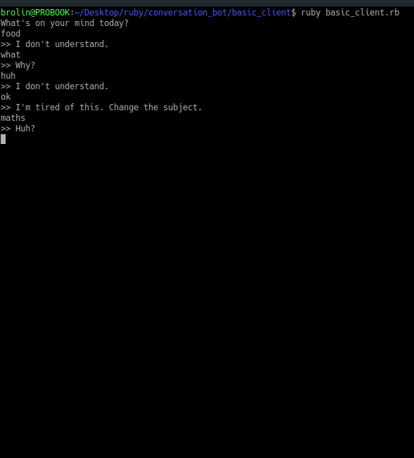
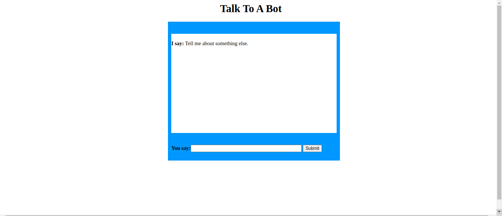

# Conversation_bot
A telegram bot working as a personal resume

# By Brolin Remunyanga

## Introduction

**Conversation_bot** is a chatter-bot that emulates a psychotherapist like conversation with.The bot can be used on both the terminal or Browser.Just type your questions and concerns and hit return. The bot responds on the words you use.

## Content

+ Installation.
+ Running the bot within a terminal.
+ Using the bot in a Browser.
+ About the project.
+ Contact.

## Installation

1. Click the repository's clone or download button and copy the https link.
2. Open a terminal on your machine.
2. Within the terminal, navigate to the directory or make one for the bot files.

    **In windows by using:**
    ```
    cd directory
    ```
    To go to a directory
    If you don't know the name of a directory, use:
    ```
    dir
    ```
    To see the available directories and files within the one you're currently at.

    **In an unix terminal using:**
    ```
    cd directory
    ```
    To go to a directory
    If you don't know the name of a directory, use:
    ```
    ls
    ```
    To see the available directories and files within the one you're currently at.

3. Do git clone (Shift+Ctrl+v) to download the files into the current directory.
4. Change into the new directory created by the git clone command.
5. Install the required gems with bundler. For both operating systems do:
    ```
    bundle
    ```

## Running the bot in the terminal

1. Open a terminal.

2. Within the terminal, navigate to the bot's basic_client directory

## In windows by using:
```
cd directory
```


To go to a directory If you don't know the name of a directory, use:
```
dir
```

To see the available directories and files within the one you're currently at.

## In an unix terminal using:
```
cd directory
```

To go to a directory If you don't know the name of a directory, use:
```
ls
```
To see the available directories and files within the one you're currently at.

3. Run the bot

## In windows:
```
ruby basic_client.rb
```

## In a unix terminal:
```
ruby basic_client.rb
```


Please note that if you close the terminal or shut down the system, the bot will stop working.

# Using the bot in the browser
1. Open a terminal.

2. Within the terminal, navigate to the bot's web_client directory

## In windows by using:
```
cd directory
```


To go to a directory If you don't know the name of a directory, use:
```
dir
```

To see the available directories and files within the one you're currently at.

## In an unix terminal using:
```
cd directory
```

To go to a directory If you don't know the name of a directory, use:
```
ls
```
To see the available directories and files within the one you're currently at.

3. Run the server

## In windows:
```
ruby web_client.cgi
```

## In a unix terminal:
```
ruby web_client.cgi
```

4.And then finaly open the browser and type 'localhost:1234/'.



Please note that if you close the terminal, shut down the system or server, the bot will stop working.


# About the project

+ Built using Ruby v 2.6.1
+ The editor used was VS Code
+ Git and Github were used for version control
+ This was build as part of microverse's technical curriculum.
+ Testing and Documentation was done using Ruby built in features.

# Thanks
+ Tennyson Takudzwa Zvaita who helped me in debugging the basic_client bot.

# Contact
For more information or help with this project please contact
Brolin Remunyanga - remunyangabrolin@gmail.com 